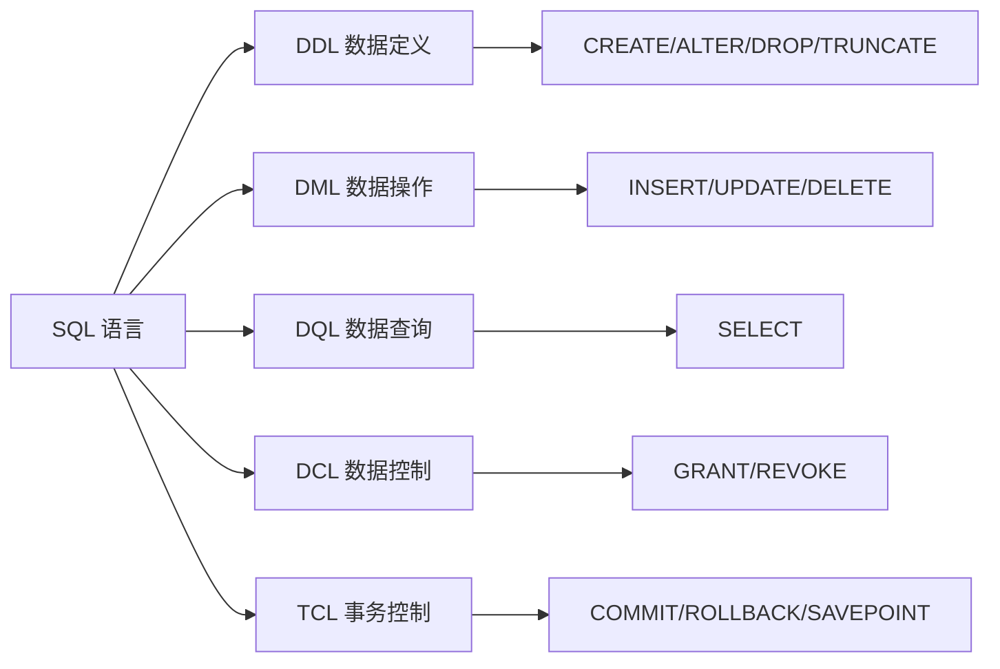

# MySQL 学习指南

> 难度递进式学习文档，覆盖从零基础到生产环境运维的完整链路，以 MySQL 8.0+ 为例。

---

## 第一阶段：认识 MySQL（入门）

### 1. MySQL 是什么？

MySQL 是世界上最流行的**关系型数据库管理系统（RDBMS）**，1995 年首次发布，2008 年被 Sun 收购，2010 年随 Sun 归入 Oracle。它将数据组织成**表**（table），通过 SQL（Structured Query Language）操作数据，以 ACID 事务保证数据一致性。

**版本演进：**

| 版本    | 年份 | 标志性特性                                           |
| ------- | ---- | ---------------------------------------------------- |
| 5.6     | 2013 | 全文索引 InnoDB 化、GTID 复制                        |
| 5.7     | 2015 | JSON 原生支持、GIS 增强、`sys` schema                |
| **8.0** | 2018 | 窗口函数、CTE、原子 DDL、降序索引、`EXPLAIN ANALYZE` |
| 8.4     | 2024 | 8.0 的 LTS 长期支持版，Bug 修复 + 安全增强           |
| 9.0     | 2024 | 创新版（非 LTS），新增 Vector 类型等                 |

> **本指南默认使用 8.0+**。窗口函数、CTE、原子 DDL 等均为 8.0 新增。

### 2. SQL 语句分类



### 3. 安装 MySQL（Docker）

```bash
# 拉取镜像
docker pull mysql:8.4

# 启动容器
docker run -d -p 3306:3306 --name mysql \
  -e MYSQL_ROOT_PASSWORD=mysql123 \
  -v /mysql/data:/var/lib/mysql \
  -v /mysql/conf:/etc/mysql \
  mysql:8.4

# Windows
mkdir C:\Soft\DockerData\mysql\conf,C:\Soft\DockerData\mysql\data
docker run -d -p 3306:3306 --name mysql \
  -e MYSQL_ROOT_PASSWORD=mysql123 \
  -v C:/Soft/DockerData/mysql/data:/var/lib/mysql \
  mysql:8.4
```

**Docker Compose（带初始化脚本）：**

```yaml
# docker-compose.yml
services:
  mysql:
    image: mysql:8.4
    container_name: mysql
    ports:
      - "${MYSQL_PORT:-3306}:3306"
    environment:
      MYSQL_ROOT_PASSWORD: ${MYSQL_ROOT_PASSWORD:-mysql123}
      MYSQL_USER: ${MYSQL_USER:-app}
      MYSQL_PASSWORD: ${MYSQL_PASSWORD:-app123}
      MYSQL_DATABASE: ${MYSQL_DATABASE:-my_app}
    volumes:
      - mysql_data:/var/lib/mysql
      - ./mysql-init.sql:/docker-entrypoint-initdb.d/init.sql:ro
    restart: unless-stopped

volumes:
  mysql_data:
```

```sql
-- mysql-init.sql —— 容器首次启动时自动执行
CREATE DATABASE IF NOT EXISTS my_app
  CHARACTER SET utf8mb4 COLLATE utf8mb4_unicode_ci;

CREATE USER IF NOT EXISTS 'app_user'@'%' IDENTIFIED BY 'app123';
GRANT ALL ON my_app.* TO 'app_user'@'%';
FLUSH PRIVILEGES;
```

### 4. 连接 MySQL

```bash
# 进入容器并连接
docker exec -it mysql mysql -uroot -pmysql123

# 连接指定数据库
docker exec -it mysql mysql -uroot -pmysql123 my_app

# 在容器外通过宿主端口连接（需先安装 mysql-client）
mysql -h 127.0.0.1 -P 3306 -u root -pmysql123

# 退出
exit
# 或
quit
```

### 5. 第一组命令

```sql
-- 查看所有数据库
SHOW DATABASES;

-- 创建数据库
CREATE DATABASE my_app CHARACTER SET utf8mb4 COLLATE utf8mb4_unicode_ci;

-- 切换数据库
USE my_app;

-- 查看当前使用的数据库
SELECT DATABASE();

-- 创建表
CREATE TABLE users (
  id INT PRIMARY KEY AUTO_INCREMENT,
  name VARCHAR(50) NOT NULL,
  email VARCHAR(100) UNIQUE,
  age TINYINT UNSIGNED DEFAULT 0,
  created_at TIMESTAMP DEFAULT CURRENT_TIMESTAMP
);

-- 查看表
SHOW TABLES;
DESC users;

-- 插入数据
INSERT INTO users (name, email, age) VALUES ('Alice', 'alice@example.com', 25);

-- 查询数据
SELECT * FROM users;
```

---

## 第二阶段：SQL 基础（核心技能）

### 6. 数据类型

**数值：**

| 类型               | 范围                            | 用途                                 |
| ------------------ | ------------------------------- | ------------------------------------ |
| `TINYINT`          | -128 ~ 127（UNSIGNED: 0 ~ 255） | 年龄、状态码                         |
| `SMALLINT`         | -32768 ~ 32767                  | 小范围计数                           |
| `INT` / `INTEGER`  | -21 亿 ~ 21 亿                  | 主键、数量                           |
| `BIGINT`           | -9 京 ~ 9 京                    | 大数据量主键                         |
| `FLOAT` / `DOUBLE` | 近似浮点                        | 不推荐（精度丢失）                   |
| **`DECIMAL(M,D)`** | 定点精确                        | 金额字段唯一选择，如 `DECIMAL(10,2)` |

> **金额一律用 `DECIMAL`，禁止用 `FLOAT`/`DOUBLE`。** `0.1 + 0.2 = 0.30000000000000004`。

**字符串：**

| 类型                | 说明                                              |
| ------------------- | ------------------------------------------------- |
| **`VARCHAR(N)`**    | 可变长，N 为字符数（非字节），最大 65535 字节     |
| **`CHAR(N)`**       | 定长，N ≤ 255，存固定长度数据（如 MD5、身份证号） |
| `TEXT`              | 长文本，64KB                                      |
| `MEDIUMTEXT`        | 16MB                                              |
| `LONGTEXT`          | 4GB                                               |
| `BLOB` 系列         | 二进制大对象                                      |
| `ENUM('a','b','c')` | 枚举（不推荐——加值需 ALTER TABLE）                |

**日期与时间：**

| 类型            | 格式                  | 范围                        |
| --------------- | --------------------- | --------------------------- |
| **`TIMESTAMP`** | `2026-07-30 15:30:00` | 1970 ~ 2038（受时区影响）   |
| **`DATETIME`**  | `2026-07-30 15:30:00` | 1000 ~ 9999（不受时区影响） |
| `DATE`          | `2026-07-30`          | 1000 ~ 9999                 |
| `TIME`          | `15:30:00`            | -838 ~ 838 小时             |

> 经验法则：记录业务时间用 `DATETIME`，自动维护的创建/更新时间用 `TIMESTAMP`。

**JSON（MySQL 5.7+）：**

```sql
CREATE TABLE configs (
  id INT PRIMARY KEY AUTO_INCREMENT,
  data JSON
);

-- JSON 查询
SELECT data->>'$.name' AS name FROM configs;
SELECT * FROM configs WHERE JSON_EXTRACT(data, '$.theme') = 'dark';
SELECT * FROM configs WHERE data->>'$.version' >= 2;

-- JSON 索引（MySQL 8.0.17+ 多值索引）
CREATE INDEX idx_theme ON configs ((CAST(data->>'$.theme' AS CHAR(20))));
```

### 7. DDL —— 数据定义

```sql
-- ========== 数据库 ==========
CREATE DATABASE IF NOT EXISTS my_app
  CHARACTER SET utf8mb4 COLLATE utf8mb4_unicode_ci;

DROP DATABASE IF EXISTS my_app;

-- ========== 建表 ==========
CREATE TABLE users (
  id INT PRIMARY KEY AUTO_INCREMENT COMMENT '主键',
  name VARCHAR(50) NOT NULL COMMENT '用户名',
  email VARCHAR(100) NOT NULL COMMENT '邮箱',
  age TINYINT UNSIGNED DEFAULT 0 COMMENT '年龄',
  status ENUM('active','inactive') DEFAULT 'active' COMMENT '状态',
  created_at TIMESTAMP DEFAULT CURRENT_TIMESTAMP COMMENT '创建时间',
  updated_at TIMESTAMP DEFAULT CURRENT_TIMESTAMP ON UPDATE CURRENT_TIMESTAMP COMMENT '更新时间',

  UNIQUE KEY uk_email (email),
  INDEX idx_status (status),
  INDEX idx_status_age (status, age)
) ENGINE=InnoDB DEFAULT CHARSET=utf8mb4 COLLATE=utf8mb4_unicode_ci COMMENT='用户表';

-- ========== 修改表 ==========
ALTER TABLE users ADD COLUMN phone VARCHAR(20) AFTER email;
ALTER TABLE users MODIFY COLUMN name VARCHAR(100) NOT NULL;
ALTER TABLE users CHANGE COLUMN name username VARCHAR(100) NOT NULL;  -- 重命名
ALTER TABLE users DROP COLUMN phone;
ALTER TABLE users ADD INDEX idx_age (age);
ALTER TABLE users DROP INDEX idx_age;
RENAME TABLE users TO users_old;

-- ========== 删表 ==========
DROP TABLE IF EXISTS users;
TRUNCATE TABLE users;   -- 清空表数据，重置自增（不可回滚）
```

### 8. DML —— 数据操作

```sql
-- ========== INSERT ==========
INSERT INTO users (name, email, age) VALUES ('Alice', 'alice@x.com', 25);
INSERT INTO users (name, email, age) VALUES
  ('Bob', 'bob@x.com', 30),
  ('Charlie', 'charlie@x.com', 28);

-- 插入查询结果
INSERT INTO users_archive SELECT * FROM users WHERE status = 'inactive';

-- upsert（主键/唯一键冲突 → 更新）
INSERT INTO users (id, name, email) VALUES (1, 'Alice Updated', 'new@x.com')
ON DUPLICATE KEY UPDATE name = VALUES(name), email = VALUES(email);

-- ========== UPDATE ==========
UPDATE users SET status = 'inactive' WHERE id = 1;
UPDATE users SET age = age + 1, updated_at = NOW() WHERE status = 'active';

-- ⚠️ 不加 WHERE 会更新全表！生产环境务必加条件

-- ========== DELETE ==========
DELETE FROM users WHERE id = 1;

-- DELETE vs TRUNCATE
-- DELETE: 逐行删除（慢），可回滚，触发器会触发，不重置自增
-- TRUNCATE: 删表重建（快），不可回滚，不触发触发器，重置自增
```

### 9. DQL —— 数据查询

```sql
-- ========== 基础查询 ==========
SELECT id, name, age FROM users;
SELECT * FROM users;                              -- 生产环境避免 *，明确列出需要的列
SELECT DISTINCT status FROM users;                -- 去重

-- ========== WHERE 过滤 ==========
SELECT * FROM users WHERE age >= 18;
SELECT * FROM users WHERE age BETWEEN 18 AND 30;
SELECT * FROM users WHERE name IN ('Alice', 'Bob', 'Charlie');
SELECT * FROM users WHERE email IS NULL;
SELECT * FROM users WHERE email IS NOT NULL;
SELECT * FROM users WHERE name LIKE 'A%';          -- 以 A 开头
SELECT * FROM users WHERE name LIKE '%ice';        -- 以 ice 结尾
SELECT * FROM users WHERE name LIKE '%li%';        -- 包含 li
SELECT * FROM users WHERE email REGEXP '^[a-z]+@'; -- 正则

-- ========== 排序与分页 ==========
SELECT * FROM users ORDER BY age DESC;
SELECT * FROM users ORDER BY status ASC, created_at DESC;

SELECT * FROM users LIMIT 10;                     -- 前 10 条
SELECT * FROM users LIMIT 10 OFFSET 20;            -- 跳过 20，取 10（第 3 页）
-- 大偏移量优化 → 见索引章节"延迟关联"

-- ========== 别名 ==========
SELECT u.id, u.name, u.age AS user_age FROM users AS u;
```

### 10. 聚合与分组

```sql
-- 聚合函数
SELECT COUNT(*), COUNT(DISTINCT status) FROM users;
SELECT AVG(age), SUM(points), MAX(score), MIN(score) FROM users;

-- GROUP BY
SELECT status, COUNT(*) AS cnt
FROM users
GROUP BY status;

-- HAVING —— 对分组后的结果过滤（WHERE 在 GROUP BY 前过滤原始行）
SELECT status, COUNT(*) AS cnt
FROM users
GROUP BY status
HAVING cnt > 10;

-- SQL 书写顺序 vs 执行顺序
-- 书写：SELECT → FROM → WHERE → GROUP BY → HAVING → ORDER BY → LIMIT
-- 执行：FROM → WHERE → GROUP BY → HAVING → SELECT → ORDER BY → LIMIT
```

### 11. 常用内置函数

```sql
-- 字符串
SELECT CONCAT(first_name, ' ', last_name) AS full_name FROM users;
SELECT LENGTH('hello');                        -- 字节长度（5）
SELECT CHAR_LENGTH('你好');                    -- 字符长度（2）
SELECT UPPER('hello'), LOWER('HELLO');
SELECT TRIM('  hello  '), REPLACE('ab', 'a', 'x');
SELECT SUBSTRING('hello', 2, 3);               -- "ell"（下标从 1 开始）

-- 数值
SELECT ROUND(3.14159, 2);                      -- 3.14
SELECT CEIL(3.14), FLOOR(3.99);                -- 4, 3
SELECT ABS(-5), MOD(10, 3);                    -- 5, 1

-- 日期
SELECT NOW(), CURDATE(), CURTIME();
SELECT DATE_FORMAT(NOW(), '%Y-%m-%d %H:%i:%s');
SELECT DATE_ADD(NOW(), INTERVAL 7 DAY);
SELECT DATEDIFF('2026-12-31', '2026-01-01');   -- 日期间隔天数
SELECT TIMESTAMPDIFF(YEAR, birth_date, NOW()) AS age FROM users;

-- 条件
SELECT IF(age >= 18, '成年', '未成年') FROM users;
SELECT name,
  CASE WHEN age < 18 THEN '未成年'
       WHEN age < 60 THEN '成年'
       ELSE '老年'
  END AS age_group
FROM users;

-- NULL 处理
SELECT IFNULL(email, '无') FROM users;                  -- email 为 NULL 时返回 '无'
SELECT COALESCE(email, phone, '无联系方式') FROM users;  -- 返回第一个非 NULL
```

---

## 第三阶段：高级查询（进阶）

### 12. JOIN 连接

JOIN 是关系型数据库的精髓——把分散在不同表中的数据按关联关系组合起来。

```sql
-- INNER JOIN —— 仅返回两表都匹配的行
SELECT u.name, o.order_no, o.total
FROM users u
INNER JOIN orders o ON u.id = o.user_id;

-- LEFT JOIN —— 左表全部行，右表无匹配时填 NULL
SELECT u.name, o.order_no
FROM users u
LEFT JOIN orders o ON u.id = o.user_id;
-- 找出没有订单的用户：
SELECT u.name FROM users u LEFT JOIN orders o ON u.id = o.user_id
WHERE o.id IS NULL;

-- RIGHT JOIN —— 右表全保留（不常用，可用 LEFT JOIN 换向实现）
-- CROSS JOIN —— 笛卡尔积（慎用，N×M 行）
SELECT * FROM colors CROSS JOIN sizes;

-- 多表连接
SELECT u.name, o.order_no, p.name AS product_name
FROM users u
INNER JOIN orders o ON u.id = o.user_id
INNER JOIN order_items oi ON o.id = oi.order_id
INNER JOIN products p ON oi.product_id = p.id;

-- 自连接
SELECT e.name AS employee, m.name AS manager
FROM employees e
LEFT JOIN employees m ON e.manager_id = m.id;
```

**JOIN 与索引：**

```sql
-- JOIN 性能取决于关联字段上是否有索引
-- orders.user_id 必须有索引，否则 INNER JOIN 退化为全表扫描
CREATE INDEX idx_user_id ON orders(user_id);
```

### 13. 子查询

```sql
-- 标量子查询（返回单个值）
SELECT * FROM users WHERE age > (SELECT AVG(age) FROM users);

-- 行子查询
SELECT * FROM users WHERE (status, age) = (
  SELECT status, MAX(age) FROM users WHERE status = 'active'
);

-- 列子查询（IN / NOT IN）
SELECT * FROM users WHERE id IN (SELECT DISTINCT user_id FROM orders);

-- EXISTS / NOT EXISTS —— 比 IN 更适合大数据量（可用到索引）
SELECT * FROM users u
WHERE EXISTS (SELECT 1 FROM orders o WHERE o.user_id = u.id);

-- FROM 子查询（派生表必须有别名）
SELECT dept_stats.dept, dept_stats.avg_salary
FROM (SELECT dept, AVG(salary) AS avg_salary FROM employees GROUP BY dept) AS dept_stats
WHERE avg_salary > 15000;
```

### 14. UNION

```sql
-- UNION —— 合并两个查询结果，自动去重
SELECT name, email FROM users WHERE status = 'active'
UNION
SELECT name, email FROM users_archive WHERE status = 'active';

-- UNION ALL —— 不去重，性能更好（确定无重复时使用）
SELECT name FROM users
UNION ALL
SELECT name FROM new_users;

-- ⚠️ UNION 要求两边的列数、类型一致
```

### 15. 视图

视图是保存的查询——像一张虚拟表，底层不存数据。

```sql
CREATE VIEW active_users AS
SELECT id, name, email, age FROM users WHERE status = 'active';

-- 查询视图（与查表完全一样）
SELECT * FROM active_users WHERE age > 18;

-- 可更新视图（底层是单表且无聚合函数时）
UPDATE active_users SET age = 30 WHERE id = 1;

DROP VIEW IF EXISTS active_users;
```

### 16. CTE（公用表表达式）—— MySQL 8.0+

CTE 相当于在查询中定义临时命名的结果集，尤其适合复杂查询拆解。

```sql
-- 普通 CTE
WITH user_stats AS (
  SELECT status, COUNT(*) AS cnt, AVG(age) AS avg_age
  FROM users
  GROUP BY status
)
SELECT * FROM user_stats WHERE cnt > 10;

-- 多个 CTE
WITH
  active AS (SELECT * FROM users WHERE status = 'active'),
  recent AS (SELECT * FROM active WHERE created_at > DATE_SUB(NOW(), INTERVAL 30 DAY))
SELECT COUNT(*) FROM recent;

-- 递归 CTE（树形数据查询）
WITH RECURSIVE category_tree AS (
  SELECT id, name, parent_id, 0 AS level
  FROM categories WHERE parent_id IS NULL                    -- 根节点
  UNION ALL
  SELECT c.id, c.name, c.parent_id, ct.level + 1
  FROM categories c
  INNER JOIN category_tree ct ON c.parent_id = ct.id
)
SELECT * FROM category_tree;
```

### 17. 窗口函数 —— MySQL 8.0 杀手特性

窗口函数在不折叠行的情况下做跨行计算（类似 `GROUP BY` 但保留每行）。

```sql
-- 语法：function(...) OVER (PARTITION BY col ORDER BY col)

-- ROW_NUMBER —— 行号（不处理并列）
SELECT name, dept, salary,
  ROW_NUMBER() OVER (PARTITION BY dept ORDER BY salary DESC) AS rn
FROM employees;

-- RANK —— 排名（并列跳号：1,2,2,4）
-- DENSE_RANK —— 排名（并列不跳号：1,2,2,3）
SELECT name, salary,
  RANK() OVER (ORDER BY salary DESC) AS rank_num,
  DENSE_RANK() OVER (ORDER BY salary DESC) AS dense_rank_num
FROM employees;

-- LAG / LEAD —— 取前一行/后一行的值
SELECT date, revenue,
  LAG(revenue, 1) OVER (ORDER BY date) AS prev_day_revenue,
  revenue - LAG(revenue, 1) OVER (ORDER BY date) AS change
FROM daily_sales;

-- 聚合窗口 —— 每行显示部门总薪资和自己的占比
SELECT name, dept, salary,
  SUM(salary) OVER (PARTITION BY dept) AS dept_total,
  ROUND(salary / SUM(salary) OVER (PARTITION BY dept) * 100, 1) AS pct
FROM employees;
```

---

## 第四阶段：索引与性能优化

### 18. 索引原理

MySQL InnoDB 使用 **B+Tree** 索引结构：

```
                [30 | 60]           ← 非叶子节点（只存键+指针）
               /    |    \
        [10|20]  [40|50]  [70|80]   ← 非叶子节点
        /  |  \   ...       ...
       → 叶子节点：双向链表，存完整数据（聚簇索引）或主键值（二级索引）
```

- **聚簇索引**：数据按主键 B+Tree 存储，叶子节点存**整行数据**
- **二级索引**：叶子节点存的是**主键值**，查到主键后还要**回表**查聚簇索引

### 19. 索引类型

```sql
-- 主键索引（聚簇索引，自动创建）
CREATE TABLE users (id INT PRIMARY KEY AUTO_INCREMENT, ...);

-- 唯一索引
ALTER TABLE users ADD UNIQUE INDEX uk_email (email);

-- 普通索引
ALTER TABLE users ADD INDEX idx_age (age);

-- 复合索引（最常用、最需理解）
ALTER TABLE users ADD INDEX idx_status_age (status, age);

-- 前缀索引（长字符串字段只索引前 N 个字符）
ALTER TABLE articles ADD INDEX idx_title (title(20));

-- 全文索引
ALTER TABLE posts ADD FULLTEXT INDEX ft_content (title, content);
SELECT * FROM posts WHERE MATCH(title, content) AGAINST('MySQL 优化');

-- 降序索引（MySQL 8.0+）
ALTER TABLE users ADD INDEX idx_created_desc (created_at DESC);
```

### 20. 复合索引与最左前缀原则

这是 MySQL 索引中**最重要的一个概念**：

```sql
-- 创建复合索引
CREATE INDEX idx_a_b_c ON table_name (a, b, c);

-- 能用到索引的查询（遵循最左前缀）：
WHERE a = 1                     ✅ 用到 a
WHERE a = 1 AND b = 2           ✅ 用到 a, b
WHERE a = 1 AND b = 2 AND c = 3 ✅ 用到全部
WHERE a = 1 AND c = 3           ✅ 用到 a（但 c 无法使用，因为跳过了 b）
WHERE a > 1 AND b = 2           ✅ 用到 a（范围查询 a 后，b 失效）

-- 不能用索引的查询：
WHERE b = 2                     ❌ 违背最左前缀
WHERE c = 3                     ❌ 违背最左前缀
WHERE b = 2 AND c = 3           ❌ 违背最左前缀
```

**ESR 规则（同 MongoDB 逻辑一致）：**

```
复合索引列顺序：Equality → Sort → Range
等值查询字段优先 → 排序字段次之 → 范围查询字段最后
```

### 21. EXPLAIN —— 执行计划

```sql
EXPLAIN SELECT * FROM users WHERE email = 'alice@x.com';

-- 关键字段解读：
-- type: 访问类型（性能从好到坏）
--   const   → 主键/唯一键等值查（一条）
--   ref     → 普通索引等值查
--   range   → 索引范围扫描
--   index   → 全索引扫描（差）
--   ALL     → 全表扫描（最差，必须优化）

-- key: 实际使用的索引（NULL = 没用索引）
-- rows: MySQL 预估要扫描的行数
-- Extra:
--   Using index       → ✅ 覆盖索引（不用回表，最优）
--   Using where       → 在存储引擎返回行后又在 Server 层过滤
--   Using filesort    → ⚠️ 额外排序（考虑优化索引）
--   Using temporary   → ❌ 用了临时表（考虑优化查询）

-- MySQL 8.0.18+ 可用 EXPLAIN ANALYZE 查看实际执行时间和行数
EXPLAIN ANALYZE SELECT * FROM users WHERE email = 'alice@x.com';
```

### 22. 覆盖索引与延迟关联

```sql
-- 覆盖索引：查询的所有列都在索引中 → 不用回表，性能最高
CREATE INDEX idx_cover ON users (status, age, name);
-- 下面的查询全部列都在 idx_cover 中：
SELECT status, age, name FROM users WHERE status = 'active';
-- Extra: "Using index" ✅

-- 延迟关联：解决大偏移量分页的性能问题
-- ❌ 慢：OFFSET 100000 需要扫描并丢弃前 10 万行
SELECT * FROM users ORDER BY created_at LIMIT 10 OFFSET 100000;

-- ✅ 快：先在索引中定位，再回表取全量数据
SELECT u.* FROM users u
INNER JOIN (
  SELECT id FROM users ORDER BY created_at LIMIT 10 OFFSET 100000
) AS tmp ON u.id = tmp.id;
```

### 23. 慢查询日志

```sql
-- 查看慢查询配置
SHOW VARIABLES LIKE 'slow_query%';
SHOW VARIABLES LIKE 'long_query_time';

-- 开启慢查询（临时）
SET GLOBAL slow_query_log = ON;
SET GLOBAL long_query_time = 2;                -- 超过 2 秒记录

-- 永久配置 → my.cnf
-- slow_query_log = 1
-- slow_query_log_file = /var/log/mysql/slow.log
-- long_query_time = 2
-- log_queries_not_using_indexes = 1            -- 也记录未使用索引的查询
```

### 24. 查询优化要点

| 优化点                      | 说明                                                                                                                     |
| --------------------------- | ------------------------------------------------------------------------------------------------------------------------ |
| 避免 `SELECT *`             | 只取需要的列——增加覆盖索引的可能                                                                                         |
| WHERE 中避免对列做函数/计算 | `WHERE DATE(created_at) = '2026-07-30'` 不走索引 → 改为 `WHERE created_at >= '2026-07-30' AND created_at < '2026-07-31'` |
| 隐式类型转换                | `WHERE phone = 13800000000` → 如果 phone 是 VARCHAR，索引失效                                                            |
| 负向条件慎重                | `!=`、`NOT IN`、`NOT EXISTS` 通常不走索引                                                                                |
| `LIKE '%xxx'`               | 前导模糊不走索引 → 考虑全文索引                                                                                          |
| 大分页                      | 用延迟关联或游标分页                                                                                                     |
| OR 条件                     | 所有列都要有索引，否则全表扫描 → 用 UNION 替代                                                                           |

---

## 第五阶段：事务与锁

### 25. ACID

| 特性                   | 含义                     | 实现机制               |
| ---------------------- | ------------------------ | ---------------------- |
| **A**tomicity 原子性   | 要么全做，要么全不做     | undo log（回滚日志）   |
| **C**onsistency 一致性 | 事务前后数据满足所有约束 | 由其他三个特性共同保证 |
| **I**solation 隔离性   | 并发事务互不干扰         | 锁 + MVCC              |
| **D**urability 持久性  | 提交后数据不丢失         | redo log（重做日志）   |

### 26. 事务隔离级别

```sql
-- 查看当前隔离级别
SELECT @@transaction_isolation;

-- 设置隔离级别
SET SESSION TRANSACTION ISOLATION LEVEL READ COMMITTED;
```

| 隔离级别                            | 脏读 | 不可重复读 | 幻读       | 性能 |
| ----------------------------------- | ---- | ---------- | ---------- | ---- |
| `READ UNCOMMITTED`                  | ✅   | ✅         | ✅         | 最高 |
| `READ COMMITTED`                    | ❌   | ✅         | ✅         | 高   |
| **`REPEATABLE READ`（MySQL 默认）** | ❌   | ❌         | ❌（部分） | 中   |
| `SERIALIZABLE`                      | ❌   | ❌         | ❌         | 最低 |

- **脏读**：读到另一个事务未提交的修改
- **不可重复读**：同一事务中两次读取同一行数据，结果不同（行被 UPDATE 了）
- **幻读**：同一事务中两次范围查询，结果行数不同（有 INSERT/DELETE）

> MySQL 的 `REPEATABLE READ` 通过 **MVCC + 间隙锁** 在大多数场景下也解决了幻读。

### 27. MVCC 原理（多版本并发控制）

MVCC 是 InnoDB 实现高并发读写的核心机制：**读不阻塞写，写不阻塞读**。

每行数据隐藏两个字段：

- `DB_TRX_ID`：最后一次修改这行的事务 ID
- `DB_ROLL_PTR`：指向 undo log 中上一个版本的指针

```
UPDATE 操作的实际流程：
1. 对原行加 X 锁
2. 将原行拷贝到 undo log
3. 修改行数据，更新 DB_TRX_ID
4. 其他事务通过 undo log 读到旧版本（快照读）
```

**ReadView** 决定一个事务能看到哪个版本的数据：

- `READ COMMITTED`：每次 SELECT 都生成新的 ReadView → 能看到别的事务已提交的修改
- `REPEATABLE READ`：事务开始时生成一次 ReadView → 全程看到相同快照

### 28. 锁

```sql
-- 查看当前锁
SELECT * FROM performance_schema.data_locks;

-- 查看锁等待
SELECT * FROM performance_schema.data_lock_waits;
```

| 锁类型                      | 粒度      | 说明                                            |
| --------------------------- | --------- | ----------------------------------------------- |
| **表锁**                    | 表        | `LOCK TABLES t READ`；MyISAM 只能用表锁         |
| **行锁**                    | 行        | InnoDB 默认，基于索引加锁                       |
| **间隙锁（Gap Lock）**      | 索引间隙  | 锁住索引记录间的空隙，防幻读                    |
| **临键锁（Next-Key Lock）** | 行 + 间隙 | 行锁 + 间隙锁的组合，REPEATABLE READ 的默认行为 |
| **意向锁**                  | 表        | 行锁之前先在表上加意向锁（IS/IX），兼容性判断用 |
| **自增锁**                  | 表        | `AUTO_INCREMENT` 并发插入时的锁                 |

**死锁排查：**

```sql
-- 查看当前事务和锁信息
SHOW ENGINE INNODB STATUS\G
-- 搜索 "LATEST DETECTED DEADLOCK" 段落

-- 查看当前正在等待的事务
SELECT * FROM information_schema.innodb_trx;

-- 杀掉阻塞的事务
KILL <connection_id>;
```

**避免死锁：**

- 所有事务按**相同顺序**访问表和行
- 尽量缩短事务（拆成大事务为小事务）
- 在事务中尽早获取需要的全部锁
- 合理设置索引——无索引时行锁退化为表锁

### 29. 事务控制语句

```sql
START TRANSACTION;   -- 或 BEGIN

-- ... 执行 SQL ...

COMMIT;              -- 提交
ROLLBACK;            -- 回滚到事务开始

-- 保存点
SAVEPOINT sp1;
-- ... 部分操作 ...
ROLLBACK TO SAVEPOINT sp1;   -- 回滚到保存点
RELEASE SAVEPOINT sp1;       -- 释放保存点
```

---

## 第六阶段：架构与运维

### 30. 存储引擎

```sql
-- 查看支持的存储引擎
SHOW ENGINES;

-- 查看表的存储引擎
SHOW TABLE STATUS LIKE 'users';
```

| 特性         | InnoDB               | MyISAM                        |
| ------------ | -------------------- | ----------------------------- |
| **事务**     | ✅ ACID              | ❌                            |
| **行级锁**   | ✅                   | ❌（仅表锁）                  |
| **外键**     | ✅                   | ❌                            |
| **MVCC**     | ✅                   | ❌                            |
| **崩溃恢复** | ✅（redo log）       | ❌（需手动修复）              |
| **全文索引** | ✅（5.6+）           | ✅                            |
| **压缩**     | ✅（Barracuda 格式） | ✅                            |
| **适用场景** | **一切生产环境**     | 只读/日志归档（几乎不再使用） |

> MySQL 8.0 中 `information_schema` 和 `mysql` 系统库均已改为 InnoDB。**新项目唯一选择 InnoDB。**

### 31. 字符集与排序规则

```sql
-- 查看字符集
SHOW VARIABLES LIKE 'character_set%';

-- 推荐配置（my.cnf）
-- [mysqld]
-- character-set-server = utf8mb4
-- collation-server = utf8mb4_unicode_ci

-- utf8mb4 vs utf8
-- utf8:  最多 3 字节（MySQL 的 utf8 不是真正的 UTF-8！）
-- utf8mb4: 最多 4 字节 → 支持 emoji（😀）和部分 CJK 扩展字

-- 排序规则后缀含义：
-- _ci: Case Insensitive（不区分大小写）
-- _cs: Case Sensitive
-- _bin: 二进制比较（按编码值）
-- utf8mb4_unicode_ci:   Unicode 标准排序（准确，略慢）
-- utf8mb4_general_ci:   简化排序（快，某些字符排序不准）
-- utf8mb4_0900_ai_ci:   MySQL 8.0 默认（Unicode 9.0，accent insensitive）
```

### 32. 用户与权限

```sql
-- 创建用户
CREATE USER 'app_user'@'%' IDENTIFIED BY 'strong_password';
CREATE USER 'app_user'@'localhost' IDENTIFIED BY 'strong_password';

-- 授权
GRANT SELECT, INSERT, UPDATE, DELETE ON my_app.* TO 'app_user'@'%';
GRANT ALL ON my_app.* TO 'app_user'@'%';                    -- 全库权限
GRANT ALL ON *.* TO 'admin'@'localhost' WITH GRANT OPTION;   -- 超级管理员

-- 查看权限
SHOW GRANTS FOR 'app_user'@'%';

-- 撤销
REVOKE DELETE ON my_app.* FROM 'app_user'@'%';

-- 修改密码
ALTER USER 'app_user'@'%' IDENTIFIED BY 'new_password';

-- 删除用户
DROP USER 'app_user'@'%';

-- 生效
FLUSH PRIVILEGES;
```

### 33. 备份与恢复

```bash
# ===== 逻辑备份（mysqldump） =====
# 单库备份
mysqldump -u root -p my_app > my_app_$(date +%Y%m%d).sql

# 只备份表结构（无数据）
mysqldump -u root -p --no-data my_app > schema.sql

# 只备份数据
mysqldump -u root -p --no-create-info my_app > data.sql

# 备份特定表
mysqldump -u root -p my_app users orders > tables.sql

# 条件备份
mysqldump -u root -p my_app users --where="created_at > '2026-01-01'" > recent_users.sql

# 恢复
mysql -u root -p my_app < backup.sql
# 或在 MySQL 客户端内：
# SOURCE /path/to/backup.sql;
```

```bash
# ===== 物理备份（更快，适合大数据量） =====
# 需要文件系统权限，Docker 中在容器外操作
docker exec mysql mysql -u root -p -e "FLUSH TABLES WITH READ LOCK;"
docker cp mysql:/var/lib/mysql /backup/mysql_data_$(date +%Y%m%d)/
docker exec mysql mysql -u root -p -e "UNLOCK TABLES;"
```

### 34. 主从复制概念

```
┌────────────┐      binlog      ┌────────────┐
│   Master   │ ───────────────▶ │   Slave    │
│  (读写)    │                  │  (只读)    │
└────────────┘                  └────────────┘
      │                                │
  写入数据                     IO 线程拉取 binlog
  生成 binlog                  SQL 线程重放 binlog
```

> 主从复制实现：读写分离（主库写、从库读）、数据备份、高可用基础。配置较复杂，详见《MySQL 官方文档——复制》章节。云服务（RDS）通常一键开启。

---

## 第七阶段：设计规范与最佳实践

### 35. 三大范式

| 范式    | 规则                                       | 示例                                         |
| ------- | ------------------------------------------ | -------------------------------------------- |
| **1NF** | 列不可再分（原子性）                       | 不要把多值存在一个字段里（如 `"北京,上海"`） |
| **2NF** | 非主键列完全依赖主键（消除部分依赖）       | 复合主键时，非主键列不能只依赖部分主键       |
| **3NF** | 非主键列不依赖其他非主键列（消除传递依赖） | `city → province` 应该拆表，不要冗余在每行   |

**实用性原则：** 三大范式保证数据不冗余，但高频查询可能需要适当反范式（冗余字段）减少 JOIN。核心原则——**为查询而设计，不为存储而设计**。

### 36. 表设计规范清单

```sql
-- ✅ 推荐
CREATE TABLE orders (
  id BIGINT UNSIGNED NOT NULL AUTO_INCREMENT COMMENT '主键',
  order_no CHAR(22) NOT NULL COMMENT '订单号（业务唯一键）',
  user_id BIGINT UNSIGNED NOT NULL COMMENT '用户 ID',
  total DECIMAL(10,2) NOT NULL DEFAULT 0.00 COMMENT '金额（精确定点）',
  status TINYINT NOT NULL DEFAULT 0 COMMENT '0待支付,1已支付,2已取消',
  created_at DATETIME NOT NULL DEFAULT CURRENT_TIMESTAMP COMMENT '创建时间',
  updated_at DATETIME NOT NULL DEFAULT CURRENT_TIMESTAMP ON UPDATE CURRENT_TIMESTAMP COMMENT '更新时间',

  PRIMARY KEY (id),
  UNIQUE KEY uk_order_no (order_no),
  INDEX idx_user_id (user_id),
  INDEX idx_status_created (status, created_at)
) ENGINE=InnoDB DEFAULT CHARSET=utf8mb4 COLLATE=utf8mb4_unicode_ci COMMENT='订单表';
```

| 规范                     | 说明                                             |
| ------------------------ | ------------------------------------------------ |
| 主键用 `BIGINT UNSIGNED` | 42 亿条 INT 不够用，BIGINT 提前布局              |
| `NOT NULL` + `DEFAULT`   | NULL 让索引和比较行为更复杂                      |
| 金额用 `DECIMAL`         | FLOAT/DOUBLE 会丢失精度                          |
| 状态用 `TINYINT`+注释    | 比 ENUM 灵活（ALTER TABLE 不需改表结构）         |
| 时间用 `DATETIME`        | 业务时间不应受时区影响                           |
| 人人都有的 COMMENT       | 表注释 + 列注释 + 索引注释——三个月后你会感谢自己 |
| `utf8mb4`                | 不是 `utf8`——后者不支持 emoji                    |
| 合理索引                 | 为每张表分析 SQL 建立索引，不要全表无索引        |

### 37. 常见陷阱

| 陷阱                      | 说明                                                        | 正确做法                                                                 |
| ------------------------- | ----------------------------------------------------------- | ------------------------------------------------------------------------ |
| `utf8` 存 emoji           | MySQL 的 `utf8` 最多 3 字节，emoji 需要 4 字节              | 一律用 `utf8mb4`                                                         |
| `SELECT *`                | 不写列名 → 回表取所有列、无法覆盖索引、表结构变更时破坏代码 | 显式列出需要的列                                                         |
| WHERE 里对列用函数        | `WHERE YEAR(created_at) = 2026` 不走索引                    | 用范围：`WHERE created_at >= '2026-01-01' AND created_at < '2027-01-01'` |
| 不建索引就 JOIN           | 大表 JOIN 退化为全表扫描                                    | JOIN 的关联字段必须建索引                                                |
| 大事务                    | 锁定资源时间长、undo log 暴涨                               | 拆成小事务、避免在事务中有 RPC/人机交互                                  |
| 长事务不提交              | 阻塞 DDL、占用 undo log、影响从库延迟                       | 设置 `innodb_lock_wait_timeout`、监控长事务                              |
| `OFFSET` 大分页           | 100 万 OFFSET → 扫描并丢弃 100 万行                         | 延迟关联 / 游标分页                                                      |
| 无 WHERE 的 UPDATE/DELETE | 更新/删除全表                                               | 上线前必须 review 条件                                                   |

### 38. 速查表

**数据库/表操作：**

| 操作       | 命令                                        |
| ---------- | ------------------------------------------- |
| 所有数据库 | `SHOW DATABASES;`                           |
| 创建数据库 | `CREATE DATABASE db_name CHARSET utf8mb4;`  |
| 删库       | `DROP DATABASE db_name;`                    |
| 所有表     | `SHOW TABLES;`                              |
| 表结构     | `DESC table_name;` / `SHOW CREATE TABLE t;` |
| 建表       | `CREATE TABLE t (...);`                     |
| 修改表     | `ALTER TABLE t ADD/MODIFY/DROP ...;`        |
| 删表       | `DROP TABLE t;`                             |
| 清空表     | `TRUNCATE TABLE t;`                         |

**数据操作：**

| 操作   | 命令                                                        |
| ------ | ----------------------------------------------------------- |
| 插入   | `INSERT INTO t (...) VALUES (...);`                         |
| 更新   | `UPDATE t SET col = val WHERE ...;`                         |
| 删除   | `DELETE FROM t WHERE ...;`                                  |
| 查询   | `SELECT cols FROM t WHERE ... ORDER BY ... LIMIT ...;`      |
| 分组   | `SELECT ..., COUNT(*) FROM t GROUP BY ... HAVING ...;`      |
| 连接   | `... INNER/LEFT/RIGHT JOIN t2 ON ...`                       |
| 子查询 | `WHERE col IN (SELECT ...)` / `WHERE EXISTS (SELECT 1 ...)` |

**索引/权限/事务：**

| 操作     | 命令                                      |
| -------- | ----------------------------------------- |
| 建索引   | `CREATE INDEX idx_name ON t (col);`       |
| 查看索引 | `SHOW INDEX FROM t;`                      |
| 删索引   | `DROP INDEX idx_name ON t;`               |
| 执行计划 | `EXPLAIN SELECT ...;`                     |
| 创建用户 | `CREATE USER 'u'@'%' IDENTIFIED BY 'p';`  |
| 授权     | `GRANT ALL ON db.* TO 'u'@'%';`           |
| 事务     | `START TRANSACTION; ... COMMIT/ROLLBACK;` |

### 39. 参考文献

- [MySQL 8.0 Reference Manual](https://dev.mysql.com/doc/refman/8.0/en/)
- [MySQL 8.4 Release Notes](https://dev.mysql.com/doc/relnotes/mysql/8.4/en/)
- [高性能 MySQL（第 4 版）](https://www.oreilly.com/library/view/high-performance-mysql/9781492080503/)
- [The Index Lounge — MySQL 索引原理](https://use-the-index-luke.com/sql/mysql-index)
- [MySQL EXPLAIN 官方文档](https://dev.mysql.com/doc/refman/8.0/en/explain.html)
- [InnoDB 锁与事务模型](https://dev.mysql.com/doc/refman/8.0/en/innodb-locking-transaction-model.html)
